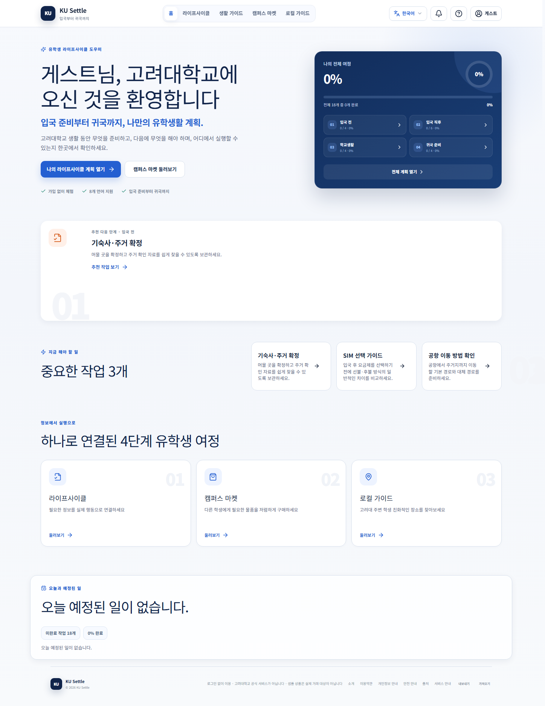
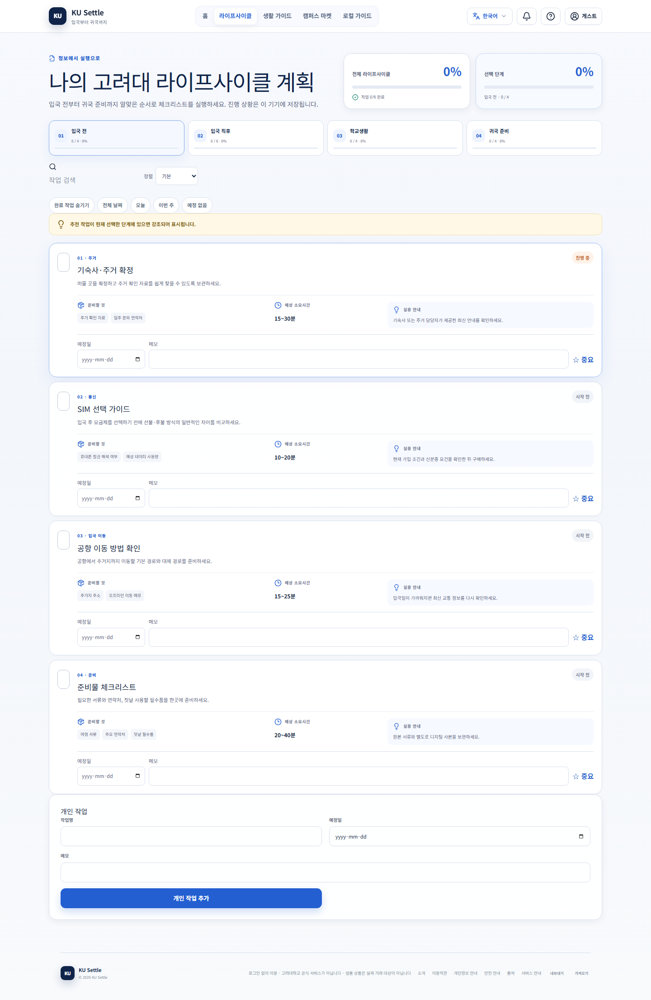
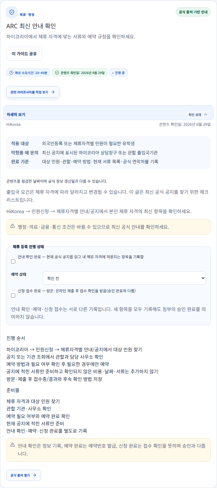
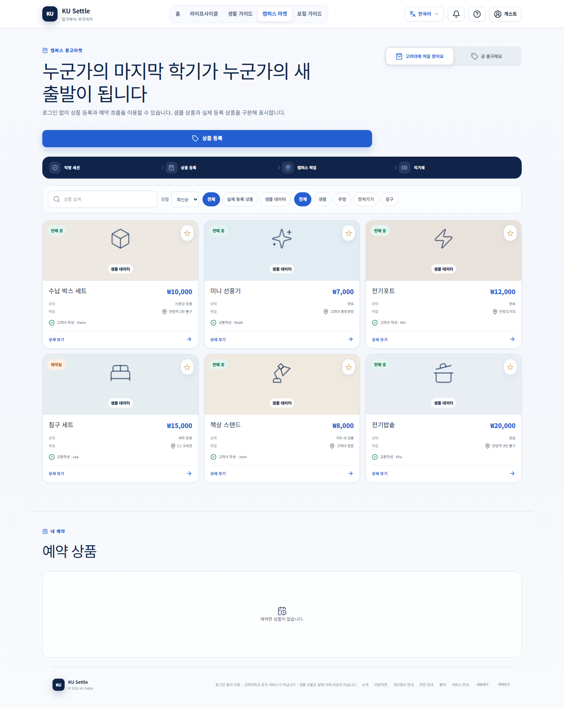

# KU Settle — 고려대학교 유학생 정착 도우미

고려대학교 유학생이 여러 공식 사이트에 흩어진 정착 정보를 찾고 실제 준비로 이어 가기 어렵다는 문제에서 출발했습니다. 활동 당시 3인 팀이 함께 아이디어를 구체화하고 발표했으며, 이 단계에서는 MVP나 서비스 코드를 개발하지 않았습니다. 발표 이후에는 본인이 혼자 Codex를 활용해 MVP 개발과 웹 서비스 고도화를 진행하고, 입국부터 귀국까지의 개인화 체크리스트와 공식 출처 기반 생활 가이드를 연결했습니다. 개인 개발 단계에서 본인은 요구사항과 수정 우선순위를 정하고 공개 화면을 확인하며 오류를 제보했고, 코드 구현·수정·테스트·문서 작업에는 Codex를 활용했습니다. 2026-10-09에 테스트 83개, 8개 언어 키 검증, 타입체크와 빌드를 통과했고 린트에는 기존 경고 2개가 남았습니다. 현재 로그인 없이 계획·가이드·샘플 마켓을 시연할 수 있으며, 이메일 인증 운영 활성화와 상품·예약의 전체 서버 흐름 검증은 남아 있습니다.

KU Settle은 고려대학교 유학생의 입국 준비, 학교생활 적응, 귀국 준비를 돕는 다국어 웹 서비스입니다. 흩어진 정보를 공식 공지 확인, 이동 경로 저장, 서류 준비, 마켓 요청 기록처럼 실행 가능한 작은 행동으로 연결합니다.

이 프로젝트의 아이디어는 “정보가 있다는 것을 아는 것”과 “그 정보를 바탕으로 실제 행동하는 것” 사이의 간극에 주목한 3인 팀 활동에서 구체화되고 발표되었습니다. 팀 활동 단계에서는 MVP나 서비스 코드를 개발하지 않았습니다. 발표 이후에는 본인이 혼자 Codex를 활용해 MVP를 개발하고 웹 서비스를 고도화했습니다. 웹 서비스로 구현함으로써 사용자가 라이프사이클 단계를 선택하고, 관련 가이드를 열고, 진행 상황을 기록한 뒤 다음 행동으로 이동하는 흐름을 직접 확인할 수 있게 했습니다.

## 프로젝트 개요

- **발견한 문제:** 유학생은 대학 공지, 체류 행정, 교통, 주거, 일상생활에 필요한 정보를 서로 다른 사이트와 언어에서 찾아 조합해야 합니다. 정보의 존재 자체보다 “이제 무엇을 해야 하는가”를 판단하는 과정이 어려울 수 있습니다.
- **팀 아이디어·발표 단계:** 3명이 함께 아이디어를 구체화하고 발표했습니다. 이 단계에서는 MVP 개발이나 서비스 코드 구현을 진행하지 않았습니다.
- **개인 MVP 개발·고도화 단계:** 발표 이후 팀에서 구체화한 아이디어를 바탕으로 본인이 혼자 MVP 개발과 웹 서비스 고도화를 진행했으며, 구현과 검증에 Codex를 활용했습니다.
- **서비스 방향:** 공식 출처 기반 안내, 개인화 체크리스트, 캠퍼스 주변 생활정보, 샘플과 실제 등록 상품을 구분한 마켓을 하나의 이용 흐름으로 연결합니다.
- **현재 범위:** 계정 없이 게스트·체험 화면을 공개 이용할 수 있습니다. Supabase 기반 계정, 마켓, 문의, 운영자 처리 흐름은 코드에 구현되어 있으나, 이메일 제공자 설정과 실행 환경 준비, 실제 운영 검증이 필요한 부분이 남아 있습니다.
- **지원 언어:** 8개 언어가 설정되어 있습니다. 영어(`en`), 한국어(`ko`), 일본어(`ja`), 중국어 간체(`zh-CN`), 우즈베크어(`uz`), 베트남어(`vi`), 몽골어(`mn`), 말레이어(`ms`).

## 본인 역할과 기여

### 팀 아이디어·발표 단계

아이디어를 구체화하고 발표한 3인 팀의 일원으로 참여했습니다. 팀 활동 단계에서는 MVP나 서비스 코드를 개발하지 않았습니다.

### 개인 MVP 개발·고도화 단계

발표 이후 팀의 아이디어를 바탕으로 MVP 개발과 웹 서비스 고도화를 혼자 진행했습니다. 개인 개발 단계에서 사용한 AI 도구는 Codex뿐입니다.

- **본인이 내린 서비스 관련 판단:** 라이프사이클과 개인화 요구사항을 정하고, 수정 우선순위를 결정했습니다. 공식 출처에 근거한 안내와 정확한 완료 기준을 요구했으며, 도메인과 이메일 제공자 설정을 마칠 때까지 이메일 발송을 비활성화하기로 판단했습니다.
- **본인의 화면 검토와 피드백:** 공개 화면을 확인하고, 설정창 재등장과 ARC 진행 상태 불일치처럼 재현 가능한 문제를 제보했습니다. 오류 메시지를 제공해 원인 조사와 수정에 활용하도록 했습니다.
- **Codex를 활용한 구현:** 코드 확인과 수정, 화면 및 다국어 콘텐츠 작성, 데이터 저장과 API 흐름 구현, 오류 조사, 테스트 작성, 문서 정리에 Codex를 활용했습니다. 이 문서에 기록한 코드 구현과 테스트 실행은 Codex의 도움을 받아 진행했습니다.
- **검증 근거:** 실행한 검사와 그 한계는 [검증 기록](#검증-기록)에 구분해 기록했습니다. 단위 테스트 통과, API 구현 여부, 실제 계정이나 거래 흐름의 동작 확인은 서로 다른 근거로 설명합니다.

## 주요 기능

### 로그인 없이 공개 이용 가능한 기능

- 입국 전, 입국 직후, 학교생활, 귀국 준비의 4단계로 구성한 게스트 라이프사이클 홈
- 이름, 입국 전후 상태, 과정 유형, 주거 유형, 입국일, 선택 입력인 귀국일을 반영하는 개인화 설정
- 체크리스트 진행 상황, 중요한 작업 추천, 예정일 메모, 브라우저 로컬 저장
- 공식 출처 링크, 적용 대상, 진행 순서, 준비물, 문의처, 완료 기준, 출처 확인 상태를 제공하는 생활 가이드
- 정리된 캠퍼스 주변 생활정보와 선택적으로 설정할 수 있는 Kakao 장소 검색 기능. 장소 카드에서 외부 Google Maps 검색·길찾기 링크를 열 수 있습니다.
- 샘플 데이터를 명확히 표시한 마켓 목록, 상품 등록 화면, 공유 가능한 상품별 주소, 모바일 반응형 화면. 등록 정보가 저장되는 위치는 아래와 같이 세션과 서버 연결 상태에 따라 달라집니다.

### 마켓의 저장 방식과 인증 범위

| 이용 방식 | 소스코드에 구현된 동작 | 검증 범위와 한계 |
| --- | --- | --- |
| 로컬 체험 | 익명 세션의 서버 연결을 사용할 수 없으면 게스트·체험 상품을 브라우저에 저장하고 샘플로 표시합니다. 예약 상태도 브라우저 로컬 상태로 표현됩니다. 기본 제공 샘플과 로컬 샘플의 상세 화면에서는 실제 예약 기능을 제공하지 않습니다. | 로컬 상태는 해당 브라우저에 종속됩니다. 샘플은 실제 거래 가능한 재고가 아니며, 로컬 기록만으로 서버 예약이 접수되었다고 볼 수 없습니다. |
| 익명 세션의 서버 저장 | 세션 초기화와 상태 조회가 성공하면 게스트·체험 상품 등록 시 `/api/marketplace/listings`를 호출하고, `session_id`와 함께 `guest_listings`에 저장합니다. 서버에 저장된 사용자 등록 상품의 예약 요청은 `/api/marketplace/listings/[id]/reservations`를 통해 `guest_reservations`에 기록합니다. 소유권은 HttpOnly 세션 쿠키를 기준으로 구분합니다. | 이메일 인증이 아니라 익명 세션을 사용하는 경로입니다. 상품 목록 GET 경로는 학생 인증 계정을 필수로 요구하지 않습니다. 쿠키를 잃어버리면 다른 기기에서 자동 복구할 수 없습니다. 기존 문서 점검에서는 운영 상품이나 예약을 생성하지 않고 코드를 확인했습니다. |
| 인증 계정 | Supabase 인증 사용자는 사용자 소유권과 RLS를 적용한 `marketplace_items`를 통해 상품을 등록·수정합니다. 로컬 및 익명 세션 데이터를 계정으로 가져오거나 연결하는 명시적 경로가 구현되어 있습니다. | 이메일 발송과 공개 가입은 비활성 상태입니다. 계정 로그인, 데이터 가져오기·연결, 복구, 계정용 테이블과 익명 세션용 테이블 사이의 예약 연동은 격리 환경에서 전체 흐름을 검증해야 합니다. |

현재 예약 화면은 서버 요청이 끝나기 전에 로컬 상태를 먼저 갱신합니다. 따라서 서버 요청이 실패해도 로컬 예약이나 저장 안내가 화면에 남을 수 있으며, 이를 서버에서 확정된 예약으로 볼 수는 없습니다. 계정의 상품 등록 경로와 익명 세션의 예약 경로는 서로 다른 테이블을 사용합니다. 이 README는 인증 계정의 거래나 서버 실패 후 복구가 모두 검증되었다고 주장하지 않습니다. 관련 소스: [화면 분기](app/page.tsx), [익명 세션 API](app/lib/server-session.ts), [상품 API](app/api/marketplace/listings/route.ts), [예약 API](app/api/marketplace/listings/[id]/reservations/route.ts), [계정 데이터 접근 코드](app/lib/repository.ts).

### 구현되어 있으나 운영 비활성 또는 검증 미완료인 기능

- Supabase 이메일 OTP·로그인 코드와 언어별 이메일 템플릿은 구현되어 있습니다. 발신 도메인, Resend 인증정보, Send Email Hook 설정이 검증되지 않아 운영 이메일 발송은 의도적으로 비활성화한 상태입니다.
- 운영 Supabase의 신규 가입은 `disable_signup=true`로 차단합니다. 앱의 `ACCOUNT_SIGNUP_ENABLED=false`는 별도의 화면·API 제어 플래그이며, Supabase Auth의 가입 차단을 대신하지 않습니다.
- Supabase 기반 프로필, 라이프사이클 진행 기록, 실제 등록 상품, 예약, 서비스 신청, 문의, 운영자 갱신, RLS 정책, Edge Function 소스가 있습니다. 실제 서비스 운영 수준의 처리 흐름과 격리된 DB 통합 검증 환경에는 별도의 외부 설정이 필요합니다.
- `send-email` Edge Function 소스가 있습니다. 기존 확인에서 운영 엔드포인트는 이메일 설정 누락으로 HTTP 500을 반환했습니다. Send Email Hook은 활성화하지 않았으며 실제 이메일도 발송하지 않았습니다.
- 관리자 API와 통합 테스트 실행 코드는 준비되어 있습니다. 그러나 별도 테스트 Supabase, 관리자 토큰, 브라우저 실행 환경, 오류 주입 환경이 필요한 검증을 단위 테스트 통과만으로 완료했다고 표시하지 않습니다.

### 향후 계획

- 발신 도메인과 Resend·Auth Hook 설정을 검증한 뒤 이메일 발송을 활성화합니다.
- 격리된 원격 또는 로컬 Supabase 통합 환경을 준비하고, 폐기 가능한 테스트 데이터로 HTTP·브라우저 통합 검증을 다시 진행합니다.
- 문의와 서비스 신청을 실제 운영 기능으로 제공하기 전에 운영 담당자, 응답 정책, 검토 절차를 정합니다.
- 업체 예약, 결제, 배송·보관 이행, 외부 메시지 연동은 정책과 협력 업체, 개인정보 보호 요건을 정한 뒤 검토합니다.

## 기술 구성

- Next.js 16 App Router, React 19, TypeScript
- i18next, react-i18next: 8개 언어 리소스와 번역 누락 시 영어 대체 표시
- Tailwind CSS 4, 프로젝트 CSS, lucide-react 아이콘
- Supabase Auth, Postgres, RLS, Edge Functions
- Kakao Local API 연동 코드: 서버 측 REST 키와 호출 한도 보호. 외부 Google Maps 링크도 제공합니다.
- Vitest, Playwright 실행 코드, pgTAP SQL 테스트, ESLint, TypeScript, pnpm
- `pnpm install --frozen-lockfile`과 `pnpm build`를 사용하는 Vercel Next.js 배포

서버 기능을 포함한 Next.js 배포 구조입니다. `next.config.ts`에서 `output: "export"`를 사용하지 않으며, `out/`을 생성하는 정적 내보내기 방식은 지원하지 않습니다. API 경로, Auth, RLS, Edge Functions가 서비스 구성에 포함됩니다.

## 데모와 화면

- 공개 데모: [KU Settle 공개 사이트](https://temporary-fleet-maroon-2opm8kt.vercel.app/?lang=ko)

로그인 없이 확인할 수 있는 시연 순서입니다.

1. `?lang=ko`가 포함된 공개 링크를 엽니다.
2. 설정창이 나타나면 **나중에 설정**을 선택하거나, **라이프사이클** 메뉴에서 체크리스트를 확인합니다.
3. **생활 가이드**에서 **ARC 최신 안내 확인**을 열어 출처 상태, 진행 순서, 진행 기록 항목을 확인합니다.
4. **캠퍼스 마켓**에서 샘플 표시와 상품 상세의 `listing=` 주소를 확인합니다. 샘플 상품은 실제 예약 대상이 아닙니다. 상품 등록 화면은 익명 세션을 통해 서버에 저장할 수 있으므로 제출용 시연은 조회 중심으로 진행하고, 화면을 보여주기 위해 상품을 등록하지 않습니다.

아래 화면은 2026-10-09에 공개 데모에서 캡처했습니다. 계정 인증정보, 토큰, 사용자 기록은 포함하지 않았습니다.
ARC 화면은 진행 기록 항목, 진행 순서, 완료 기준을 포함한 상세 카드입니다. 캡처 당시 세션이나 데이터 쓰기를 막기 위해 서버 API 요청을 차단했습니다. 화면 표시를 확인한 자료이며 서버 저장이나 공식 콘텐츠의 최신성을 검증한 자료는 아닙니다.

## 검증 기록

아래는 기존에 실행한 검증 결과입니다. 이번 README 한국어 편집에서는 서비스 코드나 운영 설정을 변경하지 않았으며, 전체 테스트와 브라우저 검증을 새로 실행하지 않았습니다.

### 데모 레이아웃·URL 회귀 검증 — 2026-10-09

- `pnpm test` — 통과. Vitest 테스트 83개와 i18n 검증을 실행했습니다. i18n 검증 범위는 8개 언어, 13개 네임스페이스, 말단 키 504개, 코드 내 문구 572개입니다.
- `pnpm run typecheck`, `pnpm run build` — 통과. `pnpm run lint` — 오류 0개, 기존 경고 2개입니다.
- 로컬 운영용 빌드와 공개 Vercel 데모에서 각각 `pnpm run test:demo:browser`를 실행했습니다. 한국어·영어 × 1440·390·320 CSS 픽셀의 6개 조합이 모두 통과했습니다. 소스 문자열 검사나 모의 응답이 아니라 실제 Chromium 화면을 조작한 검증입니다.
- 홈의 가로 넘침, ARC 상세 본문과 예약 선택창, 가이드 펼침·접힘과 URL 상태, 상세 주소 직접 접속, 새로고침, 키보드 조작, 뒤로·앞으로 이동, 브라우저 이력 길이의 안정성을 확인했습니다. 관련 ARC 단계·카드 이동, 새로고침 후 브라우저 로컬 진행 기록 유지, 상품의 지도·공유·닫기 버튼 클릭 가능 여부, 상품 상세 주소와 이력 이동, Escape와 배경 클릭 닫기도 확인했습니다.
- 한국어·영어의 좁은 화면에서 ARC, 홈, 샘플 상품 상세 캡처를 검토했습니다. 가이드 내용을 숨기지 않고 grid·flex 크기와 줄바꿈을 조정해 넘침을 해결했습니다.
- 테스트 실행 중 6개 조합에서 세션 초기화·상태 조회 GET을 포함한 API·외부·읽기 이외의 요청 60건을 차단했습니다. 읽기 전용 계정 설정 조회와 동일 출처의 화면 리소스 요청만 허용했습니다. 운영 상품·예약·문의는 생성하지 않았습니다. DB 저장, 계정 인증, 외부 Maps 페이지 표시, 다른 브라우저 엔진, 실기기의 동작을 검증한 것은 아닙니다.
- 수정 커밋 `086c260`은 Vercel Production에 배포되었습니다. 공개 데모와 `/api/account/config`는 HTTP 200을 반환했고, 가입과 이메일 발송은 비활성 상태를 유지했습니다. Auth·이메일 제공자 설정은 변경하지 않았습니다.
- 재현 및 공개 데모 실행 방법: [읽기 전용 브라우저 회귀 검증](docs/demo-browser-regression.md).

### 이전 README 수정 당시의 코드 검사 — 2026-10-09

- `pnpm test` — 통과. 8개 언어, 13개 네임스페이스, 말단 키 504개를 검사한 뒤 Vitest 테스트 83개를 실행했습니다.
- `pnpm run typecheck` — 통과.
- `pnpm run lint` — 오류 0개, `app/page.tsx`의 기존 경고 2개가 남았습니다.
- `pnpm run build` — Next.js 16.3.2에서 통과. 동적 `/api/*` 경로가 서버 배포 결과에 포함되었습니다.

### 기존 최종 문서 검토 — 2026-10-09

- 상품·예약 화면의 분기, 익명 세션 API, 인증 계정 데이터 접근 코드를 대조해 저장 방식과 미해결 연동 한계를 문서화했습니다. 운영 데이터 쓰기는 사용하지 않았습니다.
- 가입 사전 점검 예시를 `scripts/check-auth-signup-config.mjs`와 대조했습니다. 스크립트는 `NEXT_PUBLIC_SUPABASE_URL`과 `NEXT_PUBLIC_SUPABASE_PUBLISHABLE_KEY`를 읽습니다.
- 공개 데모에서 ARC 상세를 캡처하고(HTTP 200), 이미지의 가독성을 확인했습니다. 캡처 중 서버 API 요청은 차단했습니다.
- 상대 경로의 문서·이미지 링크와 GitHub 반영본을 확인했습니다. 당시 문서 수정에서는 애플리케이션 코드를 변경하지 않았으므로 앞서 기록한 코드 검사를 다시 실행하지 않았습니다.

### 과거 또는 특정 환경에서의 검증

- 공개 publishable key로 운영 Supabase Auth 설정을 조회해 HTTP 200과 `disable_signup=true`를 확인했습니다. 설정 변경 후 `pnpm run check:auth-signup`은 종료 코드 0을 반환했습니다.
- 공개 `/api/account/config`는 가입·이메일 발송 비활성 상태에서 HTTP 200을 반환했습니다. 이메일 발송 설정이 없을 때 공개 가입 경로는 HTTP 503을 반환했습니다.
- 운영 `send-email` 엔드포인트는 404가 아닌 응답을 반환했으나, 이메일 설정 누락으로 HTTP 500을 반환했습니다. Auth Hook으로 활성화하지 않았습니다.
- Git 이력에는 가이드·상품 URL 동기화, ARC 진행 상태 동기화, 문의의 로딩·빈 내역·조회 실패 구분, 설정 검증 전 이메일 활성화 차단에 관한 수정이 있습니다. 소스 단언과 단위 테스트가 근거이며, 격리된 DB에서 전체 흐름을 실행한 검증과는 구분합니다.
- 폐기 가능한 Supabase 프로젝트, 관리자 토큰, 브라우저 오류 주입 환경, Docker 등이 필요한 실제 통합 명령은 해당 환경에서 실행한 근거가 없는 경우 통과한 것으로 집계하지 않았습니다. [격리 통합 테스트 실행 절차](docs/integration-test-runbook.md)를 참고할 수 있습니다.

### 검증 근거의 구분

- **문자열·소스 단언:** `tests/server-api.test.ts`는 API 경로와 안전성에 필요한 주요 조건을 검사합니다.
- **단위·도메인·마이그레이션 테스트:** Vitest로 파싱, i18n, 상태 마이그레이션, URL 구성, RLS·마이그레이션 전제, 이메일 템플릿 동작을 확인합니다. 운영 데이터에 접근하는 테스트는 아닙니다.
- **HTTP·배포 확인:** 공개 Vercel과 Supabase Auth의 응답을 직접 조회했습니다. 키나 응답 내 비밀값은 출력하지 않았습니다.
- **DB·브라우저 통합 검증:** 격리된 테스트 프로젝트와 폐기 가능한 인증정보가 필요합니다. 화면이나 버튼이 존재한다는 사실만으로 통합 검증 완료라고 표시하지 않습니다.

## 기술적 문제 해결 사례

### 1. 상세 주소와 화면 상태의 동기화

- **문제:** 가이드와 상품 상세는 새로고침과 뒤로·앞으로 이동 후에도 같은 화면이 열려야 하며, 상세를 닫으면 오래된 쿼리 값이 남지 않아야 했습니다.
- **선택한 해결 방법:** `history.pushState`·`replaceState`와 화면 상태를 동기화하고, `guide=`·`listing=` 식별자를 URL에 기록했습니다. 이동 시 대상 가이드·작업으로 스크롤하거나 포커스를 옮기도록 했습니다.
- **검증:** 소스 테스트와 공개 브라우저 흐름에서 URL에 따른 화면 동작을 확인했습니다. 가이드와 마켓 캡처는 그 결과 화면을 보여줍니다.
- **남은 한계:** 읽기 전용 Chromium 회귀 검증으로 한국어·영어, 3개 화면 너비의 가이드·상품 이력 이동을 확인했습니다. Safari·Firefox와 실기기 동작은 미검증입니다.

### 2. 설정 검증 전 이메일 활성화 차단

- **문제:** 앱 플래그만으로는 Supabase에 직접 요청하는 가입을 막을 수 없습니다. 발신 설정이 검증되지 않은 상태에서 로그인 기능을 제공하면 이용자가 정상 서비스로 오해할 수 있습니다.
- **선택한 해결 방법:** 앱에서 이메일 발송·제공자·도메인 검증 조건을 함께 확인하고, Supabase Auth 자체의 신규 가입 차단을 유지했습니다. 배포 전 실제 Auth 설정과 대상 프로젝트 ref를 확인하는 `scripts/check-auth-signup-config.mjs`를 추가했습니다.
- **검증:** 운영 Auth 엔드포인트에서 `disable_signup=true`를 확인했고, 사전 점검은 종료 코드 0을 반환했습니다. 공개 계정 설정은 비활성 상태를 유지했습니다.
- **남은 한계:** Resend DNS, 발신자 정보, Hook secret 설정과 폐기 가능한 이메일을 사용한 실제 OTP 검증은 운영자가 준비해야 할 항목입니다.

### 3. 게스트 데이터와 계정 데이터의 경계

- **문제:** 게스트·체험 기능의 편의성을 제공하면서도 해당 데이터가 다른 사용자의 서버 데이터로 섞이지 않도록 해야 했습니다.
- **선택한 해결 방법:** 서버 연결이 안 될 때의 브라우저 로컬 저장을 유지하고, 익명 서버 기록은 세션 쿠키로 구분했습니다. 계정 연결은 명시적 확인을 요구하며, 인증 상품에는 사용자 소유권과 RLS를 적용했습니다. 샘플과 실제 등록·소유 상품도 구분했습니다.
- **검증:** 로컬 데이터, 서버 API, 마이그레이션, 보안 관련 테스트가 통과했습니다. 운영 문의 문서에는 세션 격리와 관리자 전용 갱신 절차가 정리되어 있습니다.
- **남은 한계:** 안정적인 거래·복구를 보장한다고 설명하기 전에 쿠키 유실, 계정·익명 테이블 간 연동, 서버 응답 전 로컬 예약 갱신을 격리 환경에서 전체 흐름으로 검토해야 합니다.

## 현재 한계와 향후 개선

- 실제 결제, 업체 예약, 배송·보관 이행, 외부 채팅, 푸시 알림 연동은 제공하지 않습니다.
- 샘플 마켓 기록은 실제 거래 가능한 재고가 아닙니다. 실제 등록 상품, 예약, 서비스 신청, 문의는 Supabase 설정과 운영 정책에 영향을 받습니다.
- 이메일 OTP 코드는 구현되어 있으나 도메인, Resend, Auth Hook 설정이 각각 검증될 때까지 운영 발송은 비활성화합니다.
- 체류 행정, 주거, 교통, 의료, 통신 조건은 변경될 수 있습니다. 사용자는 연결된 공식 공지를 따라야 하며, 앱은 확인하지 않은 날짜·비용·서류를 임의로 만들지 않습니다.
- 우즈베크어, 베트남어, 몽골어, 말레이어 리소스는 공통 콘텐츠와 번역 누락 시 대체 표시 구조를 사용합니다. 최종 번역으로 제공하기 전에 원어민 및 해당 분야의 검토가 필요합니다.
- 운영자 정보, 응답 목표, 서비스 책임, 데이터 보관 정책은 임의로 정하지 않았습니다. [운영 문의 처리 문서](docs/support-operations.md)를 참고할 수 있습니다.

## 관련 문서

- [설치·배포·이메일 운영 설정](docs/setup-and-operations.md)
- [격리 통합 테스트 실행 절차](docs/integration-test-runbook.md)
- [문의 접수·운영자 처리 절차](docs/support-operations.md)
- [Supabase 통합 검증 체크리스트](docs/supabase-integration-test-checklist.md)
